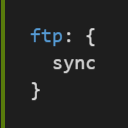

[Go Home](../README.md)
# Extensions #

The following is a list of some favorite extensions for VSCode.

* [Appearance](#appearance)
* [Development](#development)
* [Files](#files)
* [Repositories](#repositories)
* [Utilities](#utilities)

## Install an Extension ##

Click on the squarish icon on the left-hand side of the workspace.  In the search bar bar at the top enter the name of the desired extension.  Pick the desired extension and then click on the "install" button.  Then click on the "Refresh to Load" button.  

-------------------
-------------------

# Appearance #

-------------------

### Better Comments ###

[  
By: Aaron Bond](https://marketplace.visualstudio.com/items?itemName=aaron-bond.better-comments)


```JSON
{
"better-comments.tags": [
    {
      "tag": "?",
      "color": "#3498DB",
      "strikethrough": false,
      "backgroundColor": "transparent"
    },
    {
      "tag": "note",
      "color": "#66AA66",
      "strikethrough": false,
      "backgroundColor": "transparent"
    },
    {
      "tag": "warning",
      "color": "#FF8C00",
      "strikethrough": false,
      "backgroundColor": "transparent"
    },
    {
      "tag": "todo",
      "color": "#FF6600",
      "strikethrough": false,
      "backgroundColor": "transparent"
    },
    {
      "tag": "needs_work",
      "color": "#FF6600",
      "strikethrough": false,
      "backgroundColor": "transparent"
    },
    {
      "tag": "@",
      "color": "#66CC66",
      "strikethrough": false,
      "backgroundColor": "transparent"
    },
    {
      "tag": "!",
      "color": "#66CC66",
      "strikethrough": false,
      "backgroundColor": "transparent"
    },
    {
      "tag": "\\",
      "color": "#66CC66",
      "strikethrough": false,
      "backgroundColor": "transparent"
    },
    {
      "tag": "/",
      "color": "#66CC66",
      "strikethrough": false,
      "backgroundColor": "transparent"
    },
    {
      "tag": "*",
      "color": "#66CC66",
      "strikethrough": false,
      "backgroundColor": "transparent"
    },
    {
      "tag": "//",
      "color": "#474747",
      "strikethrough": true,
      "backgroundColor": "transparent"
    }
  ]
}
```

-------------------

### Bracket Pair Colorizer 2 ###

[  
By: CoenraadS](https://marketplace.visualstudio.com/items?itemName=CoenraadS.bracket-pair-colorizer-2)

Alternate colors for nested brackets/parenthesis.

-------------------

## indent-rainbow ##

[  
By: oderwat](https://marketplace.visualstudio.com/items?itemName=oderwat.indent-rainbow)

Make your indention clearly standout.

-------------------

### Material Icon Theme ###

[  
By: Philipp Kief](https://marketplace.visualstudio.com/items?itemName=PKief.material-icon-theme)

Great set of icons and looks really great in dark mode.

-------------------

### RECORE ###

[  
By: Alibaba XUX](https://marketplace.visualstudio.com/items?itemName=alixux.recore)

-------------------
-------------------


# Development #

-------------------

### autoconf ###

[  
By: maelvalais](https://marketplace.visualstudio.com/items?itemName=maelvalais.autoconf)

Syntax highlighting for autoconf, M4, and automake files (autotools)

-------------------

### bitbakers-dozen ###

[  
By: Bernard Bergan](https://marketplace.visualstudio.com/items?itemName=bbergan.bitbakers-dozen)

Syntax highlighting for bitbake recipes and configuration files.

-------------------


### C/C++ ###

[  
By: Microsoft](https://marketplace.visualstudio.com/items?itemName=ms-vscode.cpptools)

The `C/C++` extension enables a host of services:

* Language service
  * Code formatting (but we use `Uncrustify`
  * Auto-completion
  * Symbol Searching
  * Go to Definition/Declaration
  * Peek Definition/Declaration
  * Class/Method Navigation
  * Signature Help
  * Quick Info (hover)
  * Error Squiggles
* Debugging
  * Support for debugging Windows (PDB, MinGW/Cygwin), Linux, macOS and remote Linux
  * Line by line code stepping
  * Breakpoints (including conditional and function breakpoints)
  * Variable inspection
  * Multi-threaded debugging support
  * Core dump debugging support
  * Executing GDB or MI commands directly when using 'C++ (GDB/LLDB)' debugging environment


#### Configure `C/C++` extension ####

From within your sandbox in `vscode`, press the "F1" key and enter "C/CPP" and select "C/Cpp: Add Configuration" or "C/Cpp: Edit Configurations"

**`.vscode/c_cpp_properties.json`**  
```JSON
{
  "configurations": [
    {
      "name": "MSYS-linux",
      "intelliSenseMode": "gcc-x64",
      "compilerPath": "C:\\msys64\\usr\\bin\\x86_64-pc-msys-gcc.exe",
      "cStandard": "c11",
      "cppStandard": "c++17",
      "defines": [
        "CONFNAME=MSYS",
        "_DEBUG",
        "UNICODE",
        "LINUX"
      ],
      "includePath": [
        ".",
        "${fileDirname}",
        "${workspaceFolder}",
        "${workspaceFolder}\\**",
        "${workspaceFolder}\\**\\**",
        "${workspaceFolder}\\**\\**\\**",
        "${workspaceFolder}\\**\\**\\**\\**",
        "${workspaceFolder}\\**\\**\\**\\**\\**"
      ]
    }
  ],
  "version": 4
}
```

The previous is an example that can be used.  An even better example includes the header files from the product (such as UMG, Firebird, or whatever).

#### Configuring launch.json for debugging ####

For help configuring the debugger see [Configuring launch.json for C/C++ debugging](https://github.com/Microsoft/vscode-cpptools/blob/master/launch.md)

-----------------------

### C/C++ Advanced Lint ###

[  
By: Joseph Benden](https://marketplace.visualstudio.com/items?itemName=jbenden.c-cpp-flylint)

This extension can be used to accomplish the same as `cppcheck` on the Linux side.  For that matter this extension can use several different checkers/linters including `cppcheck`.

```JSON
{
    "c-cpp-flylint.cppcheck.enable": true,
    "c-cpp-flylint.cppcheck.executable": "C:/path/to/cppcheck.exe",
    "c-cpp-flylint.cppcheck.includePaths": [
        "list of include paths (usually from msys64)"
    ],
    "c-cpp-flylint.run": "onType"
}
```

-----------------------

### Markdown All in One ###

[  
By: Yu Zhang](https://marketplace.visualstudio.com/items?itemName=yzhang.markdown-all-in-one)

Markdown linting and style checking along with syntax highlighting.  This also provides a live preview.

------------------------------

### Python ###

[  
By: Microsoft](https://marketplace.visualstudio.com/items?itemName=ms-python.python)

Linting, Debugging (multi-threaded, remote), code formatting, refactoring, unit tests, and more...

```JSON
{
  "python.autoComplete.addBrackets": true,
  "python.linting.enabled": true,
  "python.linting.lintOnSave": true,
  "[python]": {
    "editor.tabSize": 4,
    "editor.insertSpaces": true
  },
}
```

------------------------------
------------------------------

# Files #

---

### EditorConfig for VS Code ###

[  
By: EditorConfig](https://marketplace.visualstudio.com/items?itemName=EditorConfig.EditorConfig)

This extension is used to process the `.editorconfig` files and apply the contained rules to `vscode`.  The Supported properties are:

* indent_style
* indent_size
* tab_width
* end_of_line
* insert_final_newline
* trim_trailing_whitespace

For more information on `.editorconfig` files see [EditorConfig site](https://editorconfig.org/)

------------------------------

### ftp-sync ###

[  
By: Lukasz Wronski](https://marketplace.visualstudio.com/items?itemName=lukasz-wronski.ftp-sync)


Open `vscode` in your new sandbox.
Press the `F1` key and enter "ftp-sync" and select the "ftp-sync: Init" command.

**`.vscode/ftp-sync.json`**
```JSON
{
    "remotePath": "<your-sandbox-on-build-server>",
    "host": "<build-server-name>",
    "username": "<your-username-on-build-server>",
    "port": 22,
    "secure": true,
    "protocol": "sftp",
    "uploadOnSave": true,
    "passive": false,
    "debug": false,
    "privateKeyPath": "<path-to-id_rsa-on-pc>",
    "passphrase": null,
    "ignore": [
        "\\.vscode",
        "\\.git",
        "\\.svn",
        "\\.DS_Store",
        "build.bat",
        "[A-Za-z0-9._-]*.code-workspace"
    ],
    "generatedFiles": {
        "uploadOnSave": false,
        "extensionsToInclude": [],
        "path": ""
    }
}
```

------------------------------

### Remote Workspace ###

[  
By: Marcel J. Kloubert](https://marketplace.visualstudio.com/items?itemName=mkloubert.vscode-remote-workspace)

Adds functionality to the built-in capabilities of `vscode` regarding workspaces. Multi-protocol support (e.g., Azure, S3, FTP(s), SFTP, ...) for handling remote files like local files.


--------------------------------
--------------------------------
--------------------------------


# Repositories #

---

### GitHub Issues and PRs ###

[  
By: Microsoft](https://marketplace.visualstudio.com/items?itemName=ms-vscode.github-issues-prs)

View the issues assigned to you

```JSON
{
  "github.repositories": [
    "renaissance-code/firebird"
  ],
  "github.host": "ghe.int.vertivco.com",
  "github.username": "your-user-name"
}
```

------------------------------

### GitHub Pull Requests ###

[  
By: GitHub](https://marketplace.visualstudio.com/items?itemName=GitHub.vscode-pull-request-github)

Unbelievably great extension that allows you to do thorough *Pull Request* reviews right from VSCode.

```JSON
{
  "githubPullRequests.hosts": [
    {
      "host": "https://github.com",
      "username": "your-user-name"
    }
  ]
}
```

------------------------------

### GitLens ###

[  
By: Eric Amodio](https://marketplace.visualstudio.com/items?itemName=eamodio.gitlens)

Integration into the editor and the explorer of various git information.  Think: git blame supercharged.

```JSON
{
  "gitlens.advanced.messages": {
    "suppressShowKeyBindingsNotice": true
  },
  "gitlens.views.fileHistory.enabled": true,
  "gitlens.views.lineHistory.enabled": true,
  "gitlens.defaultDateStyle": "absolute",
}
```

------------------------------

### gi ###

Git Ignore file generation

------------------------------

### SVN ###

[  
By: Chris Johnston](https://marketplace.visualstudio.com/items?itemName=johnstoncode.svn-scm)

Integrated `subversion`.

```JSON
{
  "svn.enabled": true,
  "svn.path": "C:\\Program Files\\TortoiseSVN\\bin\\svn.exe",

}
```

--------------------------------
--------------------------------
--------------------------------

# Utilities #

---

### Doxygen ###

Keyword highlighting and intellisense for adding doxygen commentary.

-----------------------

### Sort lines ###

[  
By: Daniel Imms](https://marketplace.visualstudio.com/items?itemName=Tyriar.sort-lines)

Var sorting options.

--------------------------------

### SVG ###

[  
By: cssho](https://marketplace.visualstudio.com/items?itemName=cssho.vscode-svgviewer)

--------------------------------

### Uncrustify ###

[  
By: LaurentTreguier](https://marketplace.visualstudio.com/items?itemName=LaurentTreguier.uncrustify)


This extension is really handy as it will allow you to quickly change your code to adhere to coding standards.

First install the `uncrustify` program on you PC (for the following examples we will assume that it is
installed in `C:\uncrustify`).

Then install the `Uncrustify` extension into vscode.

Now add the following into either your "USER SETTINGS" or your "WORKSPACE SETTINGS".

```JSON-with-comments
{
  // disable the default formatting provided by the C/CPP extension
  "C_CPP.formatting": "Disabled",
  // identify the correct location of the executable
  "uncrustify.executablePath": "C:\\uncrustify\\uncrustify.exe"
}
```

Then add the following to your "WORKSPACE SETTINGS"

```JSON
{
  "uncrustify.configPath": "refs/beautify/conf/uncrustify.cfg"
}
```

> This is assuming that you are using the standard sandbox.  If not correct for the location of the downloaded `beautify` repository.

Then all you need to do is right mouse on an open document and select "Format Document"... Tada! formatted document.

-----


---
[Go Home](../README.md)


